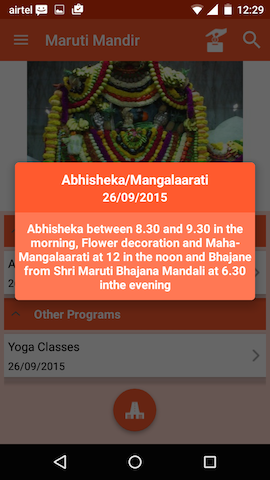
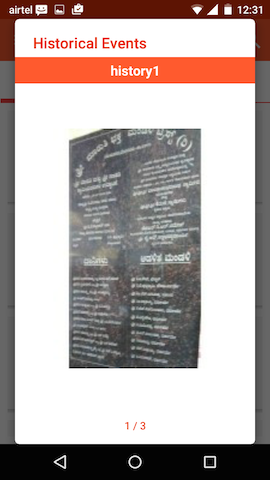
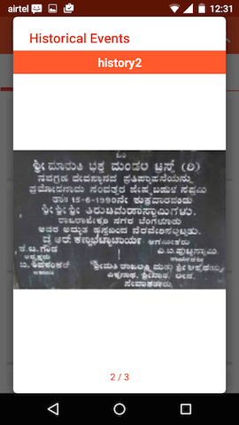
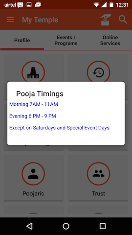
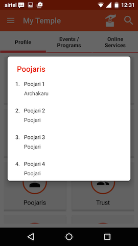
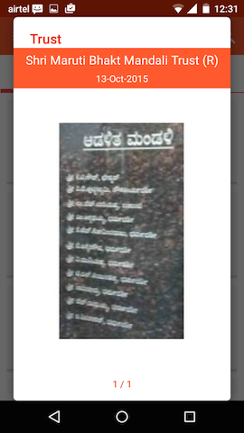
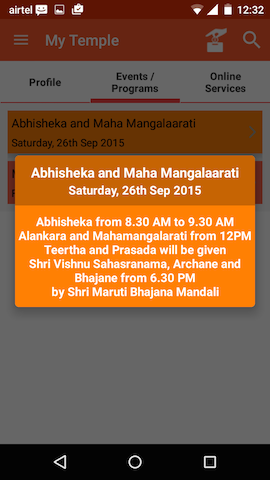

# MyTemple

This repo is a codebase of an Android App that I developed for onboarding/signing-up temples and temple committees to a common mobile platform for giving them a global reach, enabling them to provide remote Pooja services to devotees across the world and facilitating donation collections for the betterment of the temple and the society.

The App is called MyTemple and following are some screenshots of the App.

### Landing Screen

### Temple Filtering

  

### Temple Main Screen

### Upcoming Events Screens

  

### Temple Profile Grid

   

### Temple Historical Events

   

### Temple Pooja Timings

### Temple Poojaris and Trust Info

   

### Temple Gallery

   

### Temple Facilities and Donors

   

### Temple Events and Programs

   

### Temple Online Services

   

### Temple Hundi

   
